# Introduction to Open Source 2025

Welcome to the official documentation for the **Introduction to Open Source Workshop**. This guide is designed to be your companion as we move from Zero to One, i.e your first Pull Request.

## 📚 Workshop Curriculum

| Module | Topic | What We Will Cover |
| :--- | :--- | :--- |
| **01** | [**Introduction to Open Source**](./module-01-intro/01-concepts.md) | The philosophy of OSS, why we contribute, and understanding the ecosystem. |
| **02** | [**The Workbench (VS Code)**](./module-02-vscode/01-editor-setup.md) | Setting up VS Code, essential extensions (Prettier, GitGraph), and terminal basics. |
| **03** | [**Git Installation & Setup**](./module-03-git-setup/01-installation.md) | Installing Git, configuring `user.name` and `email`, and verifying SSH keys. |
| **04** | [**The Workflow**](./module-04-workflow/01-contribution.md) | Cloning repos, creating branches, committing changes, and opening Pull Requests. |

## 🗺️ The Roadmap

```mermaid
graph LR
    A[Start] --> B(Setup Env)
    B --> C{Git Ready?}
    C -- No --> B
    C -- Yes --> D(Learn Workflow)
    D --> E(Make Changes)
    E --> F[Push & PR 🚀]
```

## 🔥 Prerequisites before we start

Hardware: A laptop with internet connection.

Accounts: A GitHub Account (Please sign up before the session).

Mindset: Be ready to make mistakes, that's how we learn. :)

## 🤝 Contribution Guidelines

This documentation website is itself an open-source project. If you spot a typo or want to improve a section, feel free to fork this repository and submit a PR!

