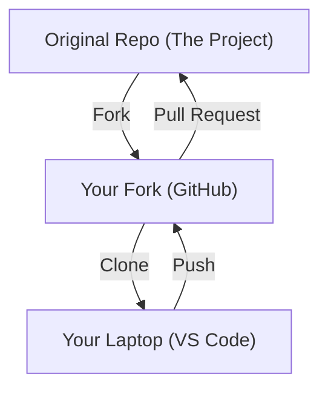

# Module 4: The Open Source Workflow


This is it. The cycle you will repeat for the rest of your career.
We are going to move code from the internet, to your computer, edit it, and send it back.

## 1. The Architecture (The Mental Model)
Before typing commands, look at this diagram. If you don't understand *where* your code is, you will get lost.



## 2. Step-by-Step Walkthrough
**Step 1: Forking (The "Copy" Button)**

You cannot write code directly to a major open source project (you don't have the password!). You must make a copy first.

Go to the repository page provided by the mentor.

Click the Fork button in the top right.

Now you have a copy at your-username/repository-name.

**Step 2: Cloning (Downloading)**

Now we bring that copy to your machine. Open your VS Code Terminal and run:

``` 
# syntax: git clone <URL-of-YOUR-fork>
git clone [https://github.com/YOUR_USERNAME/opensource-workshop-2025.git](https://github.com/YOUR_USERNAME/opensource-workshop-2025.git)
```

Then we move it into the folder.

```
cd opensource-workshop-2025
code .
```
**Step 3: Branching (The Golden Rule)**

🛑 Do not edit the main branch.
In Open Source, `main` should always match the original project. We do our work in Feature Branches.

```
# Create a new branch and switch to it
git checkout -b add-my-name
```

> (You can name the branch whatever you want, e.g., fix-nav-bar or update-readme).

**Step 4: The Cycle (Edit, Add, Commit)**

This is the loop you will do 100 times a day.

1. **Edit**: Open contributors.md (or any file) and add your name. Save the file.

2. **Stage (Add)**: Tell Git exactly which files you want to save.
```
git add .
```
3. **Commit (Save)**: Seal the changes with a message.
```
git commit -m "Added Ash to contributors list"
```
**Step 5: Pushing (Uploading)**

Your changes are currently only on your laptop. Let's send them to your GitHub Fork.
```
git push origin add-my-name
```

**Step 6: The Pull Request (The "Ask")**

1. Go to your GitHub repository in the browser.

2. You will see a yellow banner: **"add-my-name had recent pushes"**.

3. Click **Compare & pull request**.

4. Write a title and description explaining what you did. (IMPORTANT)

5. Click **Create pull request**.

🎉 Congratulations! You just made an **Open Source Contribution**.

## 3. Cheat Sheet (The Holy Grail)

These are the only commands you need for 90% of your career.

| Phase | Action | Command |
| :--- | :--- | :--- |
| **Setup** | Download Repo | `git clone <url>` |
| **Setup** | Enter Folder | `cd <folder-name>` |
| **Start** | **Create Branch** | `git checkout -b <branch-name>` |
| **Check** | View Changes | `git status` |
| **Save** | Stage Files | `git add .` |
| **Save** | Save Snapshot | `git commit -m "your message"` |
| **Share** | Upload Code | `git push origin <branch-name>` |

> **Pro Tip:** If you get stuck, run `git status`. It usually tells you exactly what to do next.

## 4. What Happens Next?

Once you open a PR, three things can happen:
1. **Merged**: The maintainer accepts your work. (Success! ✅)

2. **Requested Changes**: The maintainer asks you to fix something. (Go back to Step 4, edit, add, commit, push).

3. **Closed**: The maintainer rejects the idea. (It happens. Don't take it personally).
